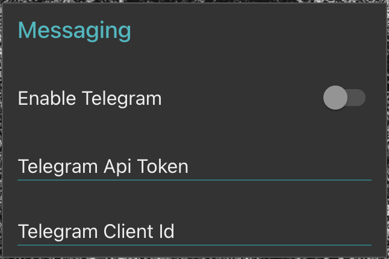
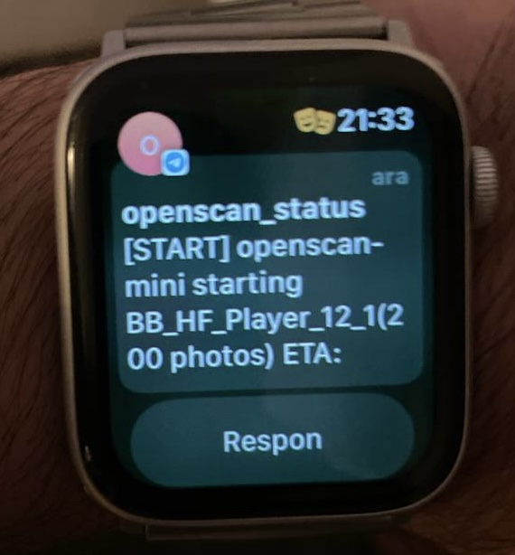

# Telegram Messaging
### Why
Would it be great to be alerted when a long session ends? The aim of this feature is to have a way (in this case, via telegram) to know when a session is started (giving some basic information about what will happen) and another message when the session ends.

### How
Its only some conditions along the existing flows. If you have activated (and properly configurated) the `Telegram Api Token` and `Telegram Client_id` you will receive the status messages to telegram.



## Setup
Everything is managed by [botfather](https://telegram.me/BotFather). Follow the next steps:

Request a new bot: send the command `/newbot`. The response to that command will be:
```
Alright, a new bot. How are we going to call it? Please choose a name for your bot.
```
Now you name your bot whtever you like. This is how you will identify your bot in your telegram user list from now on.
After choosing the name you willget that response:

```
Done! Congratulations on your new bot. You will find it at t.me/openscan_bot. You can now add a description, about section and profile picture for your bot, see /help for a list of commands. By the way, when you've finished creating your cool bot, ping our Bot Support if you want a better username for it. Just make sure the bot is fully operational before you do this.

Use this token to access the HTTP API:
4815162342:N334AA-covfefeskibidi
Keep your token secure and store it safely, it can be used by anyone to control your bot.

For a description of the Bot API, see this page: https://core.telegram.org/bots/api
```

This is a really important part: store that token safely as its the way you will securely talk with your bot.

Now you have 2 ways to fint your "client_id":

The first is open a chat with [@userinfo](https://t.me/userinfobot). If you type ```/start```there you will get an ```Id```response and you can complete the process.

Another way is opening an url in your browser to get your id:

```
https://api.telegram.org/bot<telegram_token>/getUpdates
```

you will revive a response like this:

```
{"ok":true,"result":[{"update_id":462349,
"message":{"message_id":123,"from":{"id":1111111,"is_bot":false,"first_name":"Meanwhile","username":"meanwhile","language_code":"ca"},
```

The Client_id is the "id" field (not the "update_id" or "message_id").
Upon completing the settings with that information you are ready to go!

